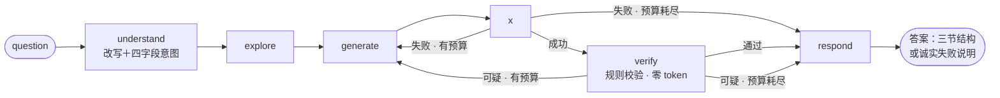

# 问数 (qadata)


对话式数据分析 Agent：自然语言问题 → SQL → 只读沙箱执行 → 规则校验 → 自纠错重试 → 三节可信答案。

LangGraph 自研状态机，BIRD 基准评测驱动开发（每个数字绑实跑模型与时间窗），附多智能体 Web 演示。

## 特性

- **自纠错状态机**：执行失败与校验可疑双条件边驱动重试环，预算 3 次、`attempts` 即账本；SQL 错误规则化分类＋中文修复建议（零 token）注入重试历史。
- **只读沙箱四层**：只读连接唯一入口 / sqlglot 单语句白名单＋表名校验 / 5s 超时中断＋双行数上限 / sqlite 物理只读。全路径无旁路——模板产出的 SQL 照过四层。
- **永不编造**：失败路径不调 LLM，输出规则化的诚实失败说明；答案四节中唯一来自模型的只有【结论】（M8 起为报告式 markdown 总结），【数据依据】【口径说明】【校验标注】全部代码组装。
- **检索增强（M10）**：生产级检索层三路通道＋一归位——表卡「宽进窄出」大库选表、值链贴「值纸条」治值域不可见（唯一小库大库都触发的路）、口径字典、例题库 hybrid 召回；全经 GSSC Select 插座、图不加新节点，任何一路炸＝降级现状路径＋入账、永不因检索挂拒答。索引＝离线显式构建的可重建派生文件（`index-build`），库派生跟库走、人进料跟智能体走（双域归属）。
- **口径字典（M10）**：业务口径的**唯一通道**——evidence 直塞与 M5 指标注册表均已退役（ADR-0007/0008），改由条目级切块的字典按题检索注入（进料/切块/检索细节见「口径通道」节）。
- **多轮会话记忆**：三层记忆纯函数组装（工作草稿／预算驱动原文窗／全史归档）＋滚存摘要链——滑出窗口的轮懒补冻存逐轮一行、满批折段，无后台任务、短会话与评测形态零触发零花费；每轮附 trail 精简留痕，回放控制台与直播同形。
- **上下文工程与观测（M9）**：图内一切进模型的内容走 GSSC 装配器唯一出口（字节等价收编，双跑对拍验收）＋tiktoken 预算保险丝（评测永不触发）；OTel 标准出口把进度帧流镜像为 span 树上报 Langfuse（默认 noop，审计账本原地不动）；例题库 hybrid 召回（只进人签题、默认关）。
- **进度流与图表**：SSE 逐帧直播自纠错过程；图型判定为后端规则纯函数，LLM 不参与排版。
- **评测工程**：并发＋全局限速＋断点续跑、逐题 token/调用数/延迟入账、题型切片、两轮 diff 报告、变体矩阵。
- **测试全封闭**：600+ 测试不碰网（脚本化假模型＋调用计数断言），CI 门禁 ruff＋pytest。

## 快速上手

```bash
# 安装（Python ≥ 3.11；建议虚拟环境）
pip install -e ".[dev]"

# 配置：填 API Key；QADATA_BASE_URL / QADATA_MODEL 可指向任意 OpenAI 兼容端点
cp .env.example .env

# 问第一个问题（需要 sqlite 库文件；业务口径走智能体的口径字典，ask 无 --evidence）
qadata ask /path/to/your.sqlite "去年销售额是多少"

# BIRD 评测（数据需自行从 bird-bench 官网下载，不入库）
qadata eval --questions data/bird/dev/dev.json --db-dir data/bird/dev/dev_databases --sample 100

# 两轮跑分 diff（含题型切片；M5 分路径模式已随指标层退役）
qadata report --baseline runs/A.jsonl --current runs/B.jsonl --types runs/attribution.jsonl

# Web 演示：先构建前端，再单进程起 API＋页面（同源）
cd web && npm install && npm run build && cd ..
qadata serve --port 8000        # 打开 http://localhost:8000 创建智能体、上传 sqlite、多轮问数
```

## 架构

### 管线总览

六节点自纠错状态机（双条件边；M5 可选指标层节点已退役 ADR-0007）：



### 节点职责

| 节点 | 做什么 | 关键纪律 |
|---|---|---|
| **understand** | 问题改写为自包含查询意图，同一次调用产出四字段结构化意图（维度/过滤/输出形态/格式约束） | 「宁空勿造」：字段仅题面明示才填，失败回退原文、不烧预算 |
| **explore** | 选定相关表，注入 schema＋列注释（BIRD database_description 同款） | 表名经 sqlguard 校验，认表也认视图 |
| **generate** | LLM 生成 SQL；重试时携带失败历史＋中文修复建议 | SYSTEM_RULES 固定 prompt 最前端（吃前缀缓存），动态内容只追加尾部 |
| **execute** | 沙箱四层内只读执行 | 撞行数上限用 COUNT(*) 报真值，不静默截断 |
| **verify** | 规则校验器判可疑：空结果/聚合异常（确定性检查，零 token） | 「列出全部」类问题豁免空结果；截断不触发重试、由 respond 标注 |
| **respond** | 组装答案四节；失败路径不调 LLM | 执行耗尽时回退最近一次成功 SQL 作答并标注（答案稳定性） |

重试预算不新增状态键：`len(attempts)` 即账本。精准模式（可选，默认关）：同一 prompt 连打 K 发、结果级多数派票决——运行内采样噪声探针实证后保留代码、默认关闭。

### 口径通道（M10；M5 指标层已退役）

「口径」唯一通道＝**口径字典**：业务条目住智能体目录 `knowledge.yaml`（`qadata knowledge-feed`／web 进料双门，md/txt/csv 条目级切块、进料即向量化），问数时按消解后题面向量检索 top-K（k5/阈 0.45，票 07 定标）注入 generate 的 schema 之后，账本 knowledge_recall 行入账、失败降级照常作答；答案【口径说明】节展示召回条目首行。~~Text-to-Metrics 注册表~~（`metrics/<db>.yaml`＋metric_match 节点＋⑨闸/填槽）2026-09-21 整层退役删除（ADR-0007，判词与历史数字见「评测与结果」轨道①行）；18 条人审口径已并入字典料转世（票 09 段 A）。

### 检索增强（M10）

大库（几百表）不能把整份 schema 塞进 prompt。统一检索层住 `src/qadata/retrieval/`，**三路通道＋一归位**全部经 GSSC 的 Select 插座消费——图不加新节点，检索只活在「进模型前」；任何一路炸都退回现状路径并如实入账，**永不因检索挂而拒答**。

- **表卡（宽进窄出）**：每张表一张入场券（表名＋列名行＋列注释，**列永不单独进召回**——列进排序就有被截丢的相关列）。大库分支先向量粗召 top-K（`COARSE_TOP_K=120`，票 07 在 391 表合成库上定标：起步 top-10 逐表入率仅 63.2%、K=120 达 96.0%），交既有 LLM 精选「窄出」，再确定性补外键亲戚表——三段不合并，漏料与错选分开记账。小库全量路径根本不读索引、逐字节不动。
- **值链（值纸条）**：本波旗舰，唯一小库大库都触发的路——「值域不可见」病灶不分库大小。拿题面关键词（搭 understand 现成意图输出、零新增生成调用）去库里搜「你说的东西库里实际登记叫什么」（北京分行→`'BJ Branch'`），结果以**值纸条**附注贴在相关列旁（`列 —— 库里实际这么存：…`），**不改写用户问题**。逐列 top-K＋相对边际三旋钮票 07 定标（k5/m0.85/s0.35，值料入条率 66.7%→90.5%）。无开关＝产物即开关（有索引档＋有向量化通道就走）。
- **口径字典**：见上节——人进料业务口径条目级切块，按题检索 top-K 注入。
- **例题库（归位）**：人签题对 hybrid 召回（关键词精确命中硬保底＋向量点积次键、top-K=3 升序注入），M9 立、M10 平移进检索域（只搬家不重铸）。

**何时建索引**：库派生索引（表卡＋值）＝显式离线管理动作 `qadata index-build <库文件>`（需配 `QADATA_EMBED_MODEL`，四路共用这一把向量化通道），产物住 `data/indexes/<库指纹>/`、serve 与 eval 共用一份、换库＝天然作废。**绝不懒建**——第一个提问者不该替全库付几百次 embedding 的钱；`serve` 启动查档，缺/坏/过期＝播报一行＋现读活库降级。人进料（口径字典/例题）跟智能体走、进料即向量化（`knowledge-feed`／`examples-sign`），与库派生物分属**双域归属**（ADR-0004：按料的寿命周期分，不是用途）。

**演示形态**：给某个智能体的 `knowledge.yaml` 喂几行 md 口径（如「『有效卡』＝status 以 gold 开头」），问相关题即见【口径说明】节展示召回条目、答案按字典口径作答。向量化复用正文模型端点（`.env` 配 `QADATA_EMBED_MODEL` 即可，走现成 OpenAI 兼容 `/v1/embeddings`）——**无需独立向量数据库服务**、单进程自托管；未配 embedder 时进料走挂账、装载闸拒读带病档（诚实降级、不带病召回，非"即见"）。

### 多轮会话与三层记忆

会话＝智能体目录内的一个 YAML 文件（文件即数据库，懒建档，重启历史仍在）。下一问「带什么旧上下文」由纯函数确定性切分：

- **L1 工作记忆**：上一轮成功 SQL＋结果头部摘要，作 generate 的增量改写草稿——「这些新生」的定义写在上一轮 SQL 里。草稿仅参考，仍走完整沙箱＋校验；上轮失败则不给草稿（错误草稿不传染）。
- **L2 情节记忆**：**预算驱动窗口**（M9）——从最近往回收原文轮直至该分区 token 预算（tiktoken 计量），轮数不再是规则、K=5 只是默认换算结果；并进 understand 的改写调用做指代消解，窗口组装本身零新增调用。滑出窗口的轮不丢失：**滚存摘要链**懒补——下一问组装前顺手把每滑出轮压成一行冻存摘要、积满一批折一条标轮次范围的段落行、段落溢出丢最老（每轮只压一次、成形永不复压，非「滚动重压」）；摘要失败入账不拦答题、下次再补。落盘＝会话档可选尾键 `digest_lines`/`digest_upto`，无尾键旧档逐字节现状；CLI/eval 单轮结构上零触发。
- **L3 归档**：全史落盘，**永不进 prompt**。
- **例题库（Select 格，默认关）**：人签题对（问题→已验证 SQL）经 `qadata examples-sign` 入智能体目录 `examples.yaml`，问数时 hybrid 召回（向量分数＋关键词精确命中硬保底）top-K 相似度**升序**注入 generate——最像的贴问题最近。成功轮**永不自动吸收**（错误自我强化），进料口唯一＝人签；空池/未配置＝逐字节现状。

### 可观测性：账本 / trace / trail 三角色

三角色各管一段、互不替代（ADR-0003）：**审计账本** `traces.jsonl`（判卷与预算红线的真值单源，不随任何观测开关而动）、**trace**（OTel span 树：一问一条，节点步骤 span＋工具子 span，OTLP 上报可过滤可 diff）、**trail**（会话轮的精简留痕，回放呈现「用户当时看见什么」；「机器内部怎么跑」归 trace，thinking 流不入档）。埋点单源＝既有 SSE 进度帧流，镜像器只是它的第二消费者——**埋点常驻、开关选出口**：

```bash
# 默认关＝noop（几纳秒空操作、行为逐字节照旧）；开出口＝指到 Langfuse（自托管或云）的 OTLP 端点：
QADATA_OTEL_ENABLED=1
QADATA_OTEL_ENDPOINT=http://localhost:3000/api/public/otel   # 空＝回落 OTEL_EXPORTER_OTLP_ENDPOINT
OTEL_EXPORTER_OTLP_HEADERS="Authorization=Basic <base64(pk:sk)>,x-langfuse-ingestion-version=4"
```

**何时开**（运营知识）：① eval 批跑后归因——端点漂移/膨胀筛查按 `run_id`＋`question_id` 过滤；② 判负类探针的 prompt 原文 diff；③ 长会话怪事按 session 过滤 trace（`agent_id`＋`session_id`＋轮 ts，与反馈锚点同源）——保险丝触发史/摘要链现形/召回注入了什么都在 span 上；④ 演示与面试。**日常开发与测试＝关**（CI 断言用内存 exporter，零联网）。

**升级判据**（重提对应旧案前先读，锚点与代码注释互指）：

| 判据 | 触发条件 | 做法 | 代码锚点 |
|---|---|---|---|
| 检索索引 ANN（M10 合并单档） | numpy 全扫（已是点积引擎，owner 裁预装）实测进秒级、或条目破几万 | 本地 ANN（usearch，**仍是文件，不上服务**）——近似索引本体是百万级的事 | `src/qadata/retrieval/` 包头 + `examples.py` 模块头 |
| 大库分层召回 | 粗召（`COARSE_TOP_K=120`，票 07 定标）后仍漏「弱名多族题」——残余 3/50＝结构上限 | 真瓶颈在**分层召回＋选表预算**（RASL 形状），非索引——本票已定标兑现其升级判据证据 | `src/qadata/retrieval/cards.py` 模块头 |
| LangSmith | 想调试 graph 内部 state 时 | 不给主干地位（数据出境/离线纪律冲突）——临时给 provider 挂一个指其 OTLP collector 的 span processor 即可，不立配置面 | `src/qadata/obs.py` 模块头 |

### Web 服务面

`qadata serve` 单进程同源（FastAPI＋静态产物）：

- **智能体**＝一个数据分析助手：名称/描述＋sqlite 数据源（raw-body 字节流上传，全程零建连）＋口径字典（knowledge-feed／web 双门进料，ADR-0008 起为口径唯一面）。文件即数据库，真空启动零预置。
- **问数双端点**：`POST /api/ask`（阻塞）与 `POST /api/ask/stream`（SSE 进度流），响应同一契约工厂产出、逐字段相等钉测；会话轮次两端点同走一个落盘收口。
- **图表契约**：`chart` 字段由规则纯函数判定（时间列→折线、类别＋数值→柱、单标量→大数卡、其余→表格），前端只管渲染、零形状自判；配色与排版走已验证数据可视化规范。
- **呈现纪律**：三节分节折叠、校验旗标徽标化（✗失败/降级/⚠截断，label 承载语义不靠颜色单传）、结果值一律 textContent 进 DOM。
- 前后端契约由 Python 侧 TestClient＋假模型钉死；前端不立测试（壳不判卷，CI 保持纯 Python）。

### 评测工具链

| 模块 | 职责 |
|---|---|
| `eval/bird.py` | 跑分器：每题独立分片＋单写者收口的并发评测、`--qps` 全局限速、`--ids` 固定题集、`--out/--resume` 断点续跑逐题 flush、`--skip-respond` 省一次调用/题、逐题异常隔离 |
| `eval/match.py` | 判分：BIRD Execution Accuracy，顺序无关多重集匹配（类型分层排序防混排崩溃） |
| `eval/qtypes.py` | 题型规则标签器（六类，词边界防误命中），供归因切片 |
| `eval/report.py` | 两轮 diff、题型切片、命中/兜底分路径报告 |
| `llm/` | OpenAI 兼容网关：指数退避（429/5xx）、自建 JSONL tracing、逐题调用数/token/延迟统计 |

产物 `runs/`（逐题结果、节点 trace、token 汇总、成本账本）与 `data/` 均不入库。

### 目录结构

```
src/qadata/
├── graph/        # 六节点状态机：build / nodes / state / prompts / gssc（装配流水线＋保险丝）/ verify / intent …
├── tools/        # 沙箱：db 只读连接 / sqlguard 语句校验 / executor 资源层 / schema
├── llm/          # OpenAI 兼容网关 + 限速 + tracing + embeddings 通道（召回向量化）
├── obs.py        # OTel 观测出口：帧流→span 镜像（默认 noop）
├── assets/       # cl100k_base 词表（计量硬资产，缺失如实炸）
├── eval/         # 跑分器 / 判分 / 题型 / 报告 / 变体矩阵
├── web/          # FastAPI 服务面：app / agents / sessions / charts / feedback / serve
├── retrieval/      # M10 检索层：表卡 / 值索引 / 口径字典 / 例题召回 / 库指纹档面（升级判据在模块头）
└── cli/          # ask / eval / report / serve / feedback-export / examples-sign / knowledge-feed / index-build 薄壳
tests/            # 600+ pytest：ScriptedLLM 假模型、契约测试、AST 级纪律钉测
web/              # Vite + React + TypeScript 前端（dist 构建产物不入库）
data/  runs/      # 评测数据与运行产物（不入库）
```

## 评测与结果

判分＝BIRD Execution Accuracy（结果集顺序无关多重集匹配）。每个数字绑实跑模型与时间窗，复现命令随表附注。

| 考卷 | 结果 | 实跑模型 | 说明 |
|---|---|---|---|
| BIRD dev 随机 100 题（seed=42） | **63.0%**（simple 69.4 / moderate 53.6 / challenging 50.0） | qwen3.7-flash | M1 最小闭环基线（无自纠错环），2026-09-02 |
| 固定 50 题跨库配对集 | 58.0% → 64.0% → 60.0% | deepseek-v4-flash-0731 | 自纠错＋沙箱 / verify 精准化 / M4 终局。末档 60% 为当日低档位运行——**同码同日三档 32→36→29**，端点跨时段漂移 ±4~7 题 ≫ 采样噪声 |
| 轨道① financial 冻结 50 题：纯 SQL 对照 vs 指标层（**该层已退役 ADR-0007**） | 28 vs 29；**命中率 0/50** | kimi-k2.7-code（同时段配对，同 commit） | Δ+1 落在该端点实测噪声带 ±5 内＝无统计含义；零命中归因＝BIRD 题面普遍是组合约束查询、与 18 条原子口径交集≈0 → **指标层默认保持关**（可开关演示，负结果成文） |
| 冒烟 10 题固定集 | **10/10** | glm-5.2 | 链路健康闸（非准确率指标），绑 commit f16fc7a；**与模型绑定，换模型必须重建基线** |
| M10 检索层定标（票 07 免费全科，391 表合成大库） | 表卡粗召逐表族入率 **96.0%**（K=120）／值链入条率 **90.5%**（k5·m0.85·s0.35）／字典召回 **8/10**（k5·s0.45） | — 零 LLM（纯本地两率） | 三旋钮保守值→定标值回写＝本票硬交付（值料 n=42 薄样 ±2.4pp 注记在册）。**端到端「正确率平价」与「撤 evidence 门禁」两个裁决：四轮付费考卷全被端点事故污染（超时/403 占错题 38–79%、四模型同坑），表观分只作参考读数，数字面各欠一顿端点健康期干净重跑**——判卷确定性交付押免费面，补跑协议在册 `.scratch/qadata-m10/retrospective.md` §6 |

方法学约束（比数字本身更重要的产出，均已入项目纪律）：

- **同时段配对铁律**：端点跨时段漂移实证 ≫ 改动效应，跨日 Δ 一律不可解读；线级增量只认同题集、同模型、同时段的配对或受控探针。
- **新线先探针后上线**：¥0.3 级存在性探针拦下过 ¥3.5 的无效优化；砍线规则使预算红线全程未触。
- **判卷标准落盘即冻结**：固定题集一经冻结不得换题；无结论/判负按有效交割成文。
- **全量 dev（1534 题）未跑**：解锁条款（固定集同日 ≥75% 且人工确认）未达成，如实挂起。
- 逐题复现：`qadata eval --questions … --ids tests/<固定集>.json`（各判卷绑实跑模型，换端点须同时段重配对方可解读）。

## 工程原则

1. **永不编造**：一个错数字的代价远大于一次我不知道——失败路径不调 LLM，截断如实报数。
2. **评测驱动**：改动前先由错题数据定位失败模式，改完跑固定集配对，混杂因素（换模型/审查题）如实标注。
3. **归属明确**：每类错误先问「该谁处理」（LLM/规则/沙箱/判分器），不写万能 try-except。
4. **确定性优先**：能纯函数不靠模型——图型判定、校验、错误分类、记忆切窗全为可单测的确定性代码；LLM 只出现在改写、SQL 生成、结论一句话与指标复核四处。
5. **成本入账**：逐题记录调用数与 token，预算红线与砍线规则在每个里程碑的账本上可审计。
6. **测试封闭**：不碰网、不碰真实目录——假模型脚本化应答＋调用计数断言＋AST 级纪律钉测（如「web 包禁 import sqlite3」「respond 永不读意图字段」）。

## 开发

```bash
pip install -e ".[dev]"
python -m pytest              # 600+ 测试，必须全绿
python -m ruff check src tests
cd web && npm run build       # 前端产物 web/dist（开发期 npm run dev）
```

CI（GitHub Actions）门禁＝ruff＋pytest。提交信息用 conventional 前缀＋中文描述。

## 文档

设计与里程碑档案（各卷 spec/复盘/成本账本）按里程碑存放于本地 `.scratch/`（不入库）；对外以本 README、代码与测试为事实来源。演示定位如实声明：作品集 demo，数据源仅 sqlite，「演示即策展」，公网部署/多租户/凭证管理不在范围内。
